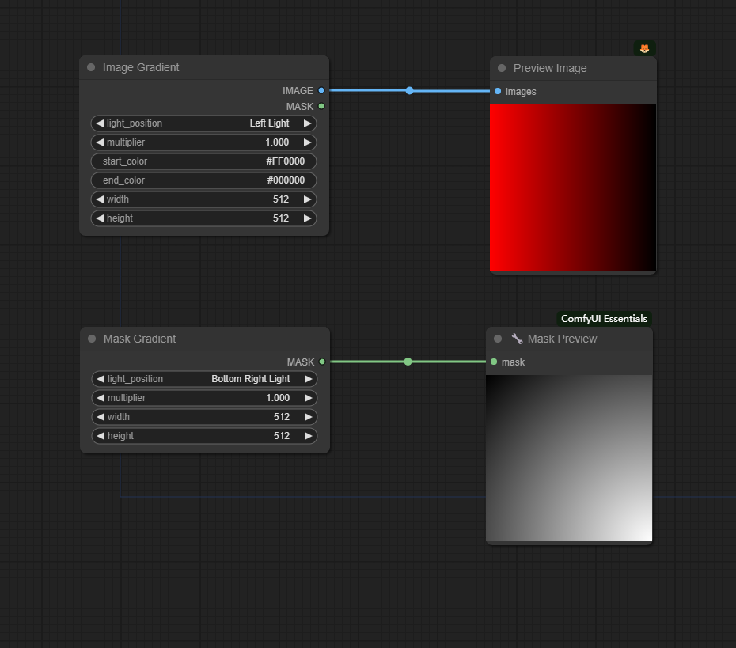

# ComfyUI Light Gradient

A set of nodes for ComfyUI Light Gradient.  


  
<font size="1">*this workflow (workflow.png) is in the example directory.  </font><br /> 


## How to install 

* Recommended use ComfyUI Manager for installation.

* Or open the cmd window in the plugin directory of ComfyUI, like ```ComfyUI\custom_nodes```，type    
```
git clone https://github.com/huagetai/ComfyUI_LightGradient.git
```
* Or download the zip file and extracted, copy the resulting folder to ```ComfyUI\custom_ Nodes```    

* Restart ComfyUI.


## Nodes

1. **Image Gradient Node**
* input
  * width - width of Mask
  * height - height of Mask
  * light_position - position of Light
  * multiplier - strength of Light
  * start_color - start color of gradient
  * end_color - end color of gradient
* output
  * IMAGE

2. **Mask Gradient Node**
* input
  * width - width of Mask
  * height - height of Mask
  * light_position - position of Light
  * multiplier - strength of Light

* output
  * Mask